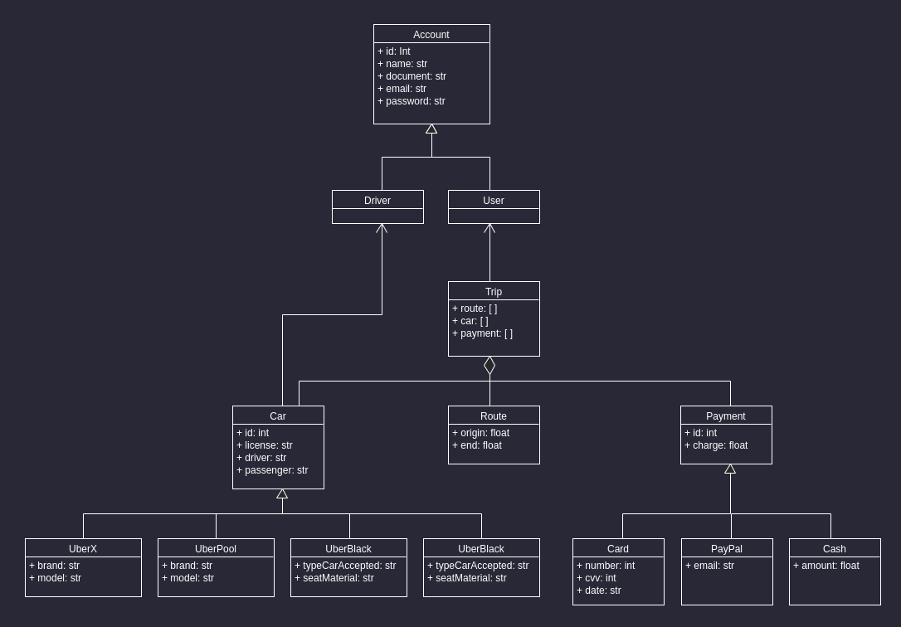

 
<h1 align="center">  </h1>

## Object-Oriented Programming Implementation

The following folders contain the class and object declarations of this basic object-oriented programming implementation of Uber in Java, JavaScript and Python.

